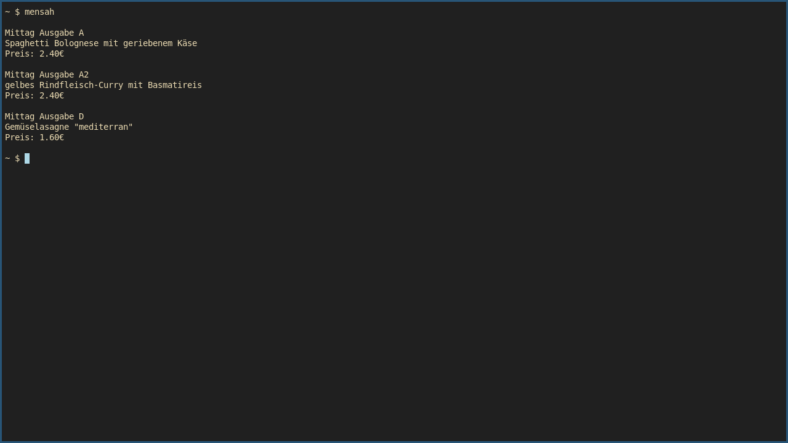

# Instructions

- put in you Cantina ID from the OpenMensa Website
- if supported by your cantina, you can change the price category
  - check with the `-d` option
  - options are: employees, others, pupils, students
- `python3 mensa.py`
  - use with an alias, shell script, conky...

# TODO/Ideas

- possibility to pass the Cantina ID from the command line
- alert system for food intolerance/ printing notes

